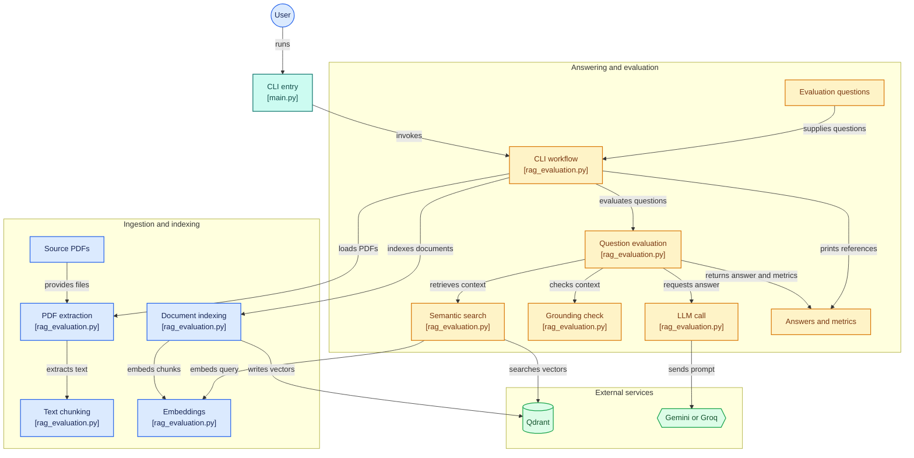

<h1 align="center"> Reference Rover - A PDF RAG Evaluation Harness 
</h1>

---
This project is a command-line PDF RAG evaluation harness. A user supplies a question or requests an evaluation run. It:

- extracts text from one or more PDF files,
- chunks and embeds the content,
- stores the vectors in Qdrant,
- answers questions using the document as the sole source of truth,
- shows references and page numbers for each answer,
- benchmarks one-turn tokens and latency for the LLM call.
---

<h2/>Scenario 1: The harness explains that it cannot answer when there is no relevant information inside the attached document. </h2>
  

<h2/>Scenario 2: The harness returns grounded responses along with source references and token usage metrics. </h2>

   

---
## Setup

1. Create a virtual environment.
2. Install dependencies:
   python -m pip install -r requirements.txt
3. Copy `.env.example` to `.env` and add your values:
   - `QDRANT_URL` (local or cloud)
   - `QDRANT_API_KEY` if using Qdrant Cloud
   - either `GEMINI_API_KEY` for Gemini or `GROQ_API_KEY` for Groq
   - optional `LLM_MODEL` to override the default model
4. Put your source PDF files in the `pdfs/` directory.

## Usage

Ask a single question:
python main.py --pdf-dir pdfs --question "What are the key requirements for the role?"

Run the evaluation set:
python main.py --pdf-dir pdfs --evaluate

## Notes

- The app is designed to answer only from the source document.
- If the answer is not present in the PDF, it clearly states that the document does not provide enough information.
- Token and latency metrics are reported for each single LLM turn.
- `thinking_tokens` is reported as `0` when the provider does not expose reasoning-token metadata.

## Files

- `main.py` — CLI entry point
- `rag_evaluation.py` — indexing, retrieval, answer generation, and benchmarking logic
- `evaluation_questions.json` — example evaluation set
- `pdfs/` — place your source PDFs here
